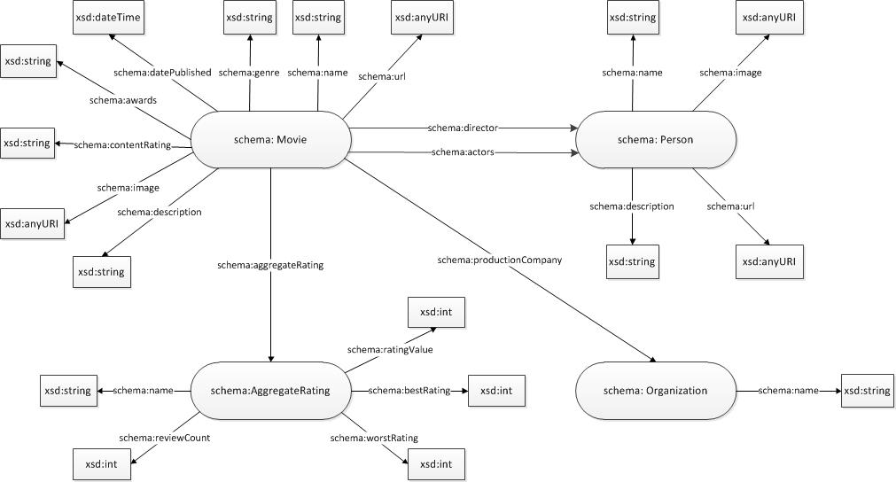

movies
======

# 1. About the project

The idea of this project is to create application that will extract data about the movies. The data is extracted from the website [Rotten Tomatoes](http://www.rottentomatoes.com), where you can find grades and comments about the movies, recommendations, lists of the best movies using different criterias and many other things.
The structured data is inserted in the website by using RDF and Microdata standards. After the data is extracted it should be transformed according to RDF standard and stored in RDF repository. Access to the extracted data is enabled through RESTful service and SPARQL Endpoint.

Several tasks should be done in order to create this applicaiton:
- Creation of web crawler which is supposed to analyze data from the webpage
- Extraction of the data inserted in the pages by using mentioned standards
- Transformation of the data into the RDF triplets
- Access to the data through RESTful service and SPARQL Endpoint

# 2. Domain model

Domain model is created in accordance with RDF vocabulary as you can see from the following picture:

Picture 1 - Domain model

Class *Movie* contains information about the movie. There are some simple data such as date when the movie is published, url of the movie's image, name, short description, genres and awards. More complex data is represented with objects of following classes: class Person (data about actors and director), class AggregateRating (data about the current rating) and class Organization (data about the production company).

Class *Person* contains basic information such as person's name, image, url address and short description about that person.

Class *AggregateRating* contains information about the movie rating which is based on visitor's votes and comments. There you can find info about the best and worst rating, review count, rating value and the name of the aggregate rating.

Class *Organization* contains name of the production company.

# 3. The solution

This application collects meta data about the movies from the webpage [Rotten Tomatoes](http://www.rottentomatoes.com). The data which the crawler is supposed to collect is decribed using Microdata standard. Extracted data is used to create domain objects that later should be stored in the RDF repository. The application allows access to that data using RESTful service.

The applications contains two REST services.

* **GET /api/ movies** - this REST service returns data about all movies. There are also some optional parameters:

* *minReleaseYear* - minimal value of the release year 
* *maxReleaseYear* - maximal value of the release year
* *actors* - name of the actors that play in the movie; there can be one or more and their names are separated by comma
* *minRatingValue* - minimal rating value
* *maxRatingValue* - maximal rating value
* *productionCompany* - name of the production company
* *genres* - genres of the movie; there can be one or more and they are separated by comma
* *directedBy* - name of the director of the movie
* *minReviewCount* - minimal review count
* *hasAwards* - only movies that are awarded
* *offset* - start position of the solutions
* *limit* - number of solutions

The example of this service call:
> GET / movies?minRevireCount=10&genres=Drama,Comedy&minReleaseYear=2012&productionCompany=ParamountPictures

* **GET/movies/id** - it returns data about the movie with this id

The example of this service call:
> GET/movies/3d548b4f-07e6-4e7f-8ebc-770b8801f5a6

# 4. Technical realisation

The application is written in programming language Java, using Eclipse as development environment. 

[Jsoup library](http://jsoup.org/) is used for analyzing and collecting the data from the web pages. It provides a very convenient API for extracting and manipulating data, using the best of DOM, CSS, and jquery-like methods.

In this application is also used [Jenabean library](https://code.google.com/p/jenabean/) for mapping Java objects into RDF triplets using annotations. Jenabean provides explicit binding between an object property and a particular RDF property.

[Jena TDB](http://jena.apache.org/documentation/tdb/) library is used for data storage in the RDF repository. TDB is a component of Jena for RDF storage and query. It support the full range of Jena APIs.

Implementation of the RESTful web service is supported by [Jersey](https://jersey.java.net/) framework. Jersey is the open source JAX-RS Reference Implementation for building RESTful Web services. It uses annotations which define type of the HTTP requests (GET, POST ...) and also the path to the requested resource. 

# 5. Acknowledgements
This application has been developed as a part of the project assignment for the subject [Intelligent Systems](http://is.fon.rs) at the Faculty of Organization Sciences, University of Belgrade.

& 6. Licence
This software is licensed under the MIT License.
